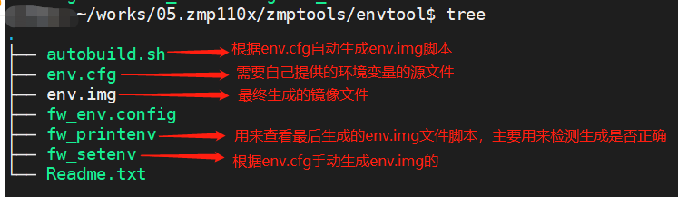
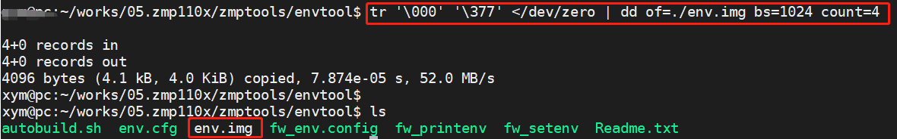
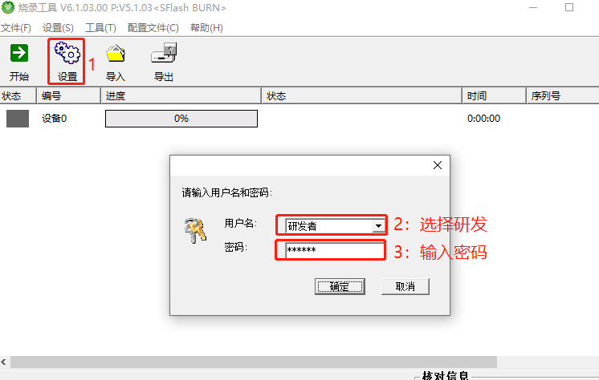
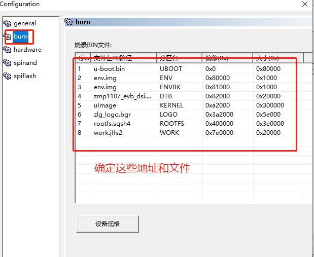
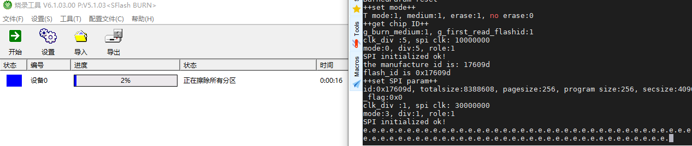

# 快速入门

## 安装必要软件包

```bash
sudo apt install vim gcc g++ make libncurses5-dev net-tools  xinetd  openssh-server u-boot-tools liblzma-doc

```

## 安装交叉编译器

```bash
sudo tar -xvf arm-zlgmcu-linux-uclibcgnueabi.tar.bz2 -C /opt/
```

配置环境变量

```bash
vim ~/.bashrc
#最后添加下面语句

export PATH="/opt/arm-zlgmcu-linux-uclibcgnueabi/bin:"$PATH
export ARCH=arm
export CROSS_COMP ILE=arm-zlgmcu-linux-uclibcgnueabi-

#使配置生效
source ~/.bashrc

#验证是否生效
arm-zlgmcu-linux-uclibcgnueabi-gcc -v
#提示输出如下，则成功

Using built-in specs.
COLLECT_GCC=/opt/arm-zlgmcu-linux-uclibcgnueabi/bin/arm-zlgmcu-linux-uclibcgnueabi-gcc.br_real
COLLECT_LTO_WRAPPER=/opt/arm-zlgmcu-linux-uclibcgnueabi/bin/../libexec/gcc/arm-zlgmcu-linux-uclibcgnueabi/4.9.4/lto-wrapper
Target: arm-zlgmcu-linux-uclibcgnueabi
Configured with: ./configure --prefix=/work/zmp110x/buildroot-2018.02.7/output/host --sysconfdir=/work/zmp110x/buildroot-2018.02.7/output/host/etc --enable-static --target=arm-zlgmcu-linux-uclibcgnueabi --with-sysroot=/work/zmp110x/buildroot-2018.02.7/output/host/arm-zlgmcu-linux-uclibcgnueabi/sysroot --disable-__cxa_atexit --with-gnu-ld --disable-libssp --disable-multilib --with-gmp=/work/zmp110x/buildroot-2018.02.7/output/host --with-mpc=/work/zmp110x/buildroot-2018.02.7/output/host --with-mpfr=/work/zmp110x/buildroot-2018.02.7/output/host --with-pkgversion='Buildroot 2018.02.7' --with-bugurl=http://bugs.buildroot.net/ --disable-libquadmath --disable-libsanitizer --enable-tls --disable-libmudflap --enable-threads --without-isl --without-cloog --with-float=soft --disable-decimal-float --with-abi=aapcs-linux --with-cpu=arm926ej-s --with-float=soft --with-mode=arm --enable-languages=c,c++ --with-build-time-tools=/work/zmp110x/buildroot-2018.02.7/output/host/arm-zlgmcu-linux-uclibcgnueabi/bin --enable-shared --disable-libgomp
Thread model: posix


```

修复交叉编译器问题:使用下面的命令

```bash
sudo ln -s /usr/lib/x86_64-linux-gnu/libmpfr.so.6 /usr/lib/x86_64-linux-gnu/libmpfr.so.4
```

注意：该教程编译器会导致ubuntu18.04系统命令clear无法使用，把交叉编译器环境变量去掉即可恢复系统的clear清屏命令。

## U-Boot

### 源码下载

```bash
git clone https://gitee.com/mg_plus/zmp110x_uboot_2013.10.0.git
```

### 编译

```bash
make distclean
make zmp110x_evb
make all -j4
```

最终生成镜像文件`u-boot.bin`如下：


## Kernel

### 源码下载

```bash
git clone https://gitee.com/mg_plus/zmp110x_linux_4.1.192.git
```


### 编译

```bash
make distclean
make O=../bd_kernel zmp1107_evb_defconfig
make O=../bd_kernel uImage dtbs modules -j4
make O=../bd_kernel INSTALL_MOD_PATH=../bd_modules modules_install -j4
```

生成的内核镜像uImage、设备树dtb、在`bd_kernel/arch/arm/boot`目录下。

模块安装目录默认在`../bd_modules`目录下。

## 文件系统

### 源码下载

```bash
git clone https://gitee.com/mg_plus/zmp110x_buildroot.git
```

### 编译

```bash
make distclean
make zmp110x_defconfig
make menuconfig
make -j12
```

最终在`zmp110x_buildroot/output/images`目录生成`rootfs.tar`文件系统，现在我们需要把`rootfs.tar`解压到nfs的共享目录，方便后续作为网络文件系统，且制作sqsh格式的文件系统

```bash
#1.解压文件系统到nfs共享目录(假如nfs共享目录为~/nfs_rootfs)
sudo tar rootfs.tar -C ~/nfs_rootfs
#2.制作squashfs格式文件系统
cd  ~/nfs_rootfs
sudo mksquashfs ./nfs_rootfs ./rootfs.sqsh4 -b 64K -comp xz -noappend
#至此会在~目录下生成rootfs.sqsh4类型的文件系统，供以后使用
```


## 环境变量

环境变量源文件为`env.cfg`，我们需要使用envtool(zlg提供linux下工具)工具把`env.cfg`转换为`env.img`才能烧录到系统。

在SPI Nor-Flash芯片上，划分了两个 MTD 分区 用于存放ENV 和 ENVBK环境变量，再加上Uboot默认的环境变量，系统中一共有三个环境变量：其中优先级为1>2>3

1. ENV：存放默认使用的环境变量
2. ENVBK：备份，可以和ENV使用一样的镜像
3. U-BOOT：uboot默认的环境变量

### 制作环境变量镜像


1. envtool工具介绍

   

2. 准备`env.cfg`文件，放到envtool工具的目录下。其中内容如下：

   ```bash
    env_version 1.1.00
    a_uboot_flags 0x0
    baudrate 115200
    boot_mtd run setmtd_boot; run read_dtb;run read_kernel; bootm ${loadaddr} - ${dtb_loadaddr}
    boot_mmc run setmmc_boot; run read_dtb;run read_kernel; bootm ${loadaddr} - ${dtb_loadaddr}
    boot_nfs run setnfs_boot; run read_dtb;run read_kernel; bootm ${loadaddr} - ${dtb_loadaddr}
    boot_tftp run setnfs_boot; tftp ${dtb_loadaddr} ${dtb_file}; tftp ${loadaddr} ${kernel_file}; bootm ${loadaddr} - ${dtb_loadaddr}
    bootcmd run boot_mmc
    bootdelay 1
    console ttySAK0,115200n8
    dtb_addr 0x82000
    dtb_loadaddr 0x81300000
    dtb_size 0x20000
    dtb_file zmp1107_evb_dsi.dtb
    ethaddr 00:55:7b:b5:7d:f7
    fdt_high 0xFFFFFFFF
    init /sbin/init
    ipaddr 192.168.100.17
    kernel_addr 0xa2000
    kernel_size 0x300000
    loadaddr 0x80008000
    kernel_file uImage
    memsize 128M
    mtd_root /dev/mtdblock6 rootfstype=squashfs
    mmc_root /dev/mmcblk0 rootfstype=ext4 rw rootwait
    nfs_root /dev/nfs rootfstype=nfs rw
    nfs_rootfs /work/zmp1107/nfs_rootfs
    mtdparts mtdparts=spi0.0:512K@0x0(UBOOT),4K@0x80000(ENV),4K@0x81000(ENVBK),128K@0x82000(DTB),3072K@0xa2000(KERNEL),376K@0x3a2000(LOGO),3968K@0x400000(ROOTFS),128K@0x7e0000(WORK)
    read_dtb sf probe 0:0 ${sf_hz} 0; sf read ${dtb_loadaddr} ${dtb_addr} ${dtb_size};fdt addr ${dtb_loadaddr}
    read_kernel sf probe 0:0 ${sf_hz} 0; sf read ${loadaddr} ${kernel_addr} ${kernel_size}
    setmtd_boot setenv bootargs console=${console} root=${mtd_root} init=${init} mem=${memsize} memsize=${memsize} ${mtdparts}
    setmmc_boot setenv bootargs console=${console} root=${mmc_root} init=${init} mem=${memsize} memsize=${memsize} ${mtdparts}
    setnfs_boot setenv bootargs console=${console} root=${nfs_root} nfsroot=${serverip}:${nfs_rootfs},v3,tcp ip=dhcp init=${init} mem=${memsize} memsize=${memsize} ${mtdparts}
    netmask 255.255.255.0
    serverip 192.168.100.5
    sf_hz 80000000
    update_flag 0
    vram 12M
   
   ```

3. 执行下面命令，生成一个大小为4KB空的镜像文件

   ```bash
   tr '\000' '\377' </dev/zero | dd of=./env.img bs=1024 count=4
   ```

   执行过程如下：

   

4. 执行下面任意一步即可完成env.img镜像的制作

   1. 手动输入命令`./fw_setenv -s env.cfg`生成`env.img`

      过程如下：

      ```bash
      # 执行生成env.img程序
      ./fw_setenv -s env.cfg
      ===Make Environment Image Tools Version:V1.0.01===
      ===Make Environment Image Start===
      The env size for environment(4092 bytes)
      ===Make Environment Image Success!===
      
      # 查看生成的env.img文件内容，是否和env.cfg内容相同
      ./fw_printenv
      ===Make Environment Image Tools Version:V1.0.01===
      ===Make Environment Image Start===
      env_version=1.1.00
      a_uboot_flags=0x0
      baudrate=115200
      boot_mtd=run setmtd_boot; run read_dtb;run read_kernel; bootm ${loadaddr} 
      ```

      

   2. 直接执行脚本`./autobuild.sh`自动生成`env.im`g镜像文件

      ```bash
      ./autobuild.sh
      ```

   **注意**：上面两种方法二选一即可。无论哪种方式，都可以生成env.img镜像文件供后面使用。

## 下载

烧录spi norflash使用window下的burntool-v1.03工具完成。

1. 准备文件

   1. uboot.bin
   2. env.img
   3. uImage
   4. zmp1107_evb_dsi.dtb
   5. zlg_logo.bgr
   6. rootfs.sqsh4
   7. work.jffs2

2. 设置工具

   

   

3. 进入下载模式烧录程序到spiflash

   按住boot键，然后从新上电，等1s左右松开boot键，即可进入烧录模式，此时可以看到烧录工具进度条在进行中，等待烧录完毕即可。

   


