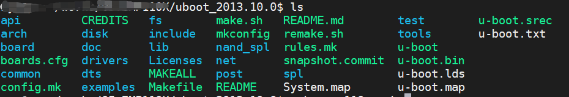

# 快速入门

## 安装必要软件包

```bash
sudo apt install vim gcc g++ make libncurses5-dev net-tools  xinetd  openssh-server u-boot-tools liblzma-doc liblzma-dev:i386 liblzma5:i386

```

## 安装交叉编译器

```bash
sudo tar -xvf arm-zlgmcu-linux-uclibcgnueabi.tar.bz2 -C /opt/
```

配置环境变量

```bash
vim ~/.bashrc
#最后添加下面语句

export PATH="/opt/arm-zlgmcu-linux-uclibcgnueabi/bin:"$PATH
export ARCH=arm
export CROSS_COMP ILE=arm-zlgmcu-linux-uclibcgnueabi-

#使配置生效
source ~/.bashrc

#验证是否生效
arm-zlgmcu-linux-uclibcgnueabi-gcc -v
#提示输出如下，则成功

Using built-in specs.
COLLECT_GCC=/opt/arm-zlgmcu-linux-uclibcgnueabi/bin/arm-zlgmcu-linux-uclibcgnueabi-gcc.br_real
COLLECT_LTO_WRAPPER=/opt/arm-zlgmcu-linux-uclibcgnueabi/bin/../libexec/gcc/arm-zlgmcu-linux-uclibcgnueabi/4.9.4/lto-wrapper
Target: arm-zlgmcu-linux-uclibcgnueabi
Configured with: ./configure --prefix=/work/zmp110x/buildroot-2018.02.7/output/host --sysconfdir=/work/zmp110x/buildroot-2018.02.7/output/host/etc --enable-static --target=arm-zlgmcu-linux-uclibcgnueabi --with-sysroot=/work/zmp110x/buildroot-2018.02.7/output/host/arm-zlgmcu-linux-uclibcgnueabi/sysroot --disable-__cxa_atexit --with-gnu-ld --disable-libssp --disable-multilib --with-gmp=/work/zmp110x/buildroot-2018.02.7/output/host --with-mpc=/work/zmp110x/buildroot-2018.02.7/output/host --with-mpfr=/work/zmp110x/buildroot-2018.02.7/output/host --with-pkgversion='Buildroot 2018.02.7' --with-bugurl=http://bugs.buildroot.net/ --disable-libquadmath --disable-libsanitizer --enable-tls --disable-libmudflap --enable-threads --without-isl --without-cloog --with-float=soft --disable-decimal-float --with-abi=aapcs-linux --with-cpu=arm926ej-s --with-float=soft --with-mode=arm --enable-languages=c,c++ --with-build-time-tools=/work/zmp110x/buildroot-2018.02.7/output/host/arm-zlgmcu-linux-uclibcgnueabi/bin --enable-shared --disable-libgomp
Thread model: posix


```

修复交叉编译器问题:使用下面的命令

```c
sudo ln -s /usr/lib/x86_64-linux-gnu/libmpfr.so.6 /usr/lib/x86_64-linux-gnu/libmpfr.so.4
```

## U-Boot

### 源码下载

```

```

### 编译

```bash
make distclean
make zmp110x_evb
make all -j4
```

最终生成镜像文件`u-boot.bin`如下：



## Kernel

### 源码下载

```bash

```


### 编译

```bash
make distclean
make O=../bd_kernel zmp1107_evb_defconfig
make O=../bd_kernel uImage dtbs modules -j4
make O=../bd_kernel INSTALL_MOD_PATH=../bd_modules modules_install -j4
```

生成的内核镜像uImage、设备树dtb、在`bd_kernel/arch/arm/boot`目录下。

模块安装目录默认在`../bd_modules`目录下。

## 文件系统

### 源码下载

```

```


### 编译

```bash
make distclean
make zmp1107_evb_defconfig
make menuconfig
make -j12
```

