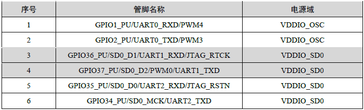
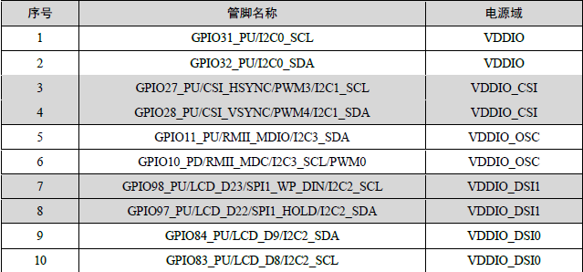

# 外设驱动

## UART驱动

zmp1107有三路串口，UART0默认是调试串口，各个串口对应的GPIO引脚如下：

目前zmp1107开发板UART1和UART2引脚被SD引脚复用，且板子没有引出测试IO，无法测试。

## I2C外设驱动

zmp1107有四路I2C，

## SPI驱动

## PWM驱动

## ADC 驱动

## USB驱动

## SD卡驱动

## 有线网络驱动

## wifi驱动

## GPIO驱动

## RTC驱动

## LCD驱动

## 音视频驱动

## emmc驱动

